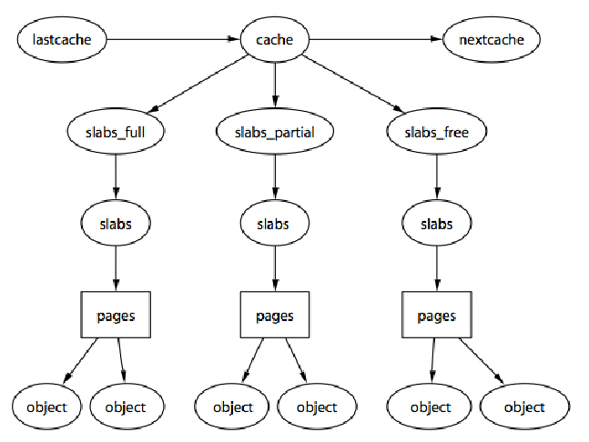

## Алгоритм управлению памятью: Buddy system + SLAB
### Содержание
[Введение](#intro)

[Глоссарий](#gloss)

[Алгоритм двойников/близнецов(buddy system)](#buddy)

[Виртуальная память](#virt)

[Slab allocator](#slab)

[Реализация](#code)

[Тестирование](#test)

[Анализ](#analys)

[Список источников](#listliter)

<a name="gloss"></a> 
### Глоссарий
1. Оперативная память (сокращенно ОЗУ/RAM) — это элемент компьютерной системы, который отвечает за временное хранение исполняемого кода операционной системы и установленных программ.
2. Операцио́нная систе́ма, сокр. ОС — комплекс взаимосвязанных программ, предназначенных для управления ресурсами компьютера и организации взаимодействия с пользователем.
3. Виртуа́льная па́мять (англ. virtual memory) — метод управления памятью компьютера, позволяющий выполнять программы, требующие больше оперативной памяти, чем имеется в компьютере, путём автоматического перемещения частей программы между основной памятью и вторичным хранилищем (например, жёстким диском).
4. Процесс — это в выполняемая в данный момент программа.
5. Кадр(frame)-блок основной памяти фиксированной длины
6. Фрагментация - это явление, при котором пространство памяти, основного или дополнительного хранилища, используется неэффективно, уменьшая емкость или производительность, а часто и то, и другое. 
7. Внутренняя фрагментация — это тип фрагментации, который имеет место, когда программе выделяется больший объем памяти, чем необходимый. Это происходит, когда память распределяется по блокам фиксированного размера.
8. Внешняя фрагментация — это дыры или неиспользуемое пространство, которое возникает среди незаразной памяти или фрагментов хранилища и слишком мало для хранения новой программы.
9. Страничная память — способ организации виртуальной памяти, при котором виртуальные адреса отображаются на физические постранично. Для 32-битной архитектуры x86 минимальный размер страницы равен 4096 байт.
10. Ядро́ (англ. kernel) — центральная часть операционной системы (ОС), обеспечивающая приложениям координированный доступ к ресурсам компьютера, таким как процессорное время, память, внешнее аппаратное обеспечение, внешнее устройство ввода и вывода информации.
11. Аллокатор — это часть программы, которая запрашивает память большими кусками напрямую у ОС через системные вызовы
12. Кэш - представляет собой небольшой объём очень быстрой памяти. Здесь мы используем кэш как память для хранения таких объектов, как семафоры, дескрипторы процессов, объекты файлов и т. д. Каждый кэш способен хранить только один тип объектов.

<a name="intro"></a> 
### Введение
Под памятью(memory) как правило подразумевается оперативная память компьютера.
Память является важнейшим ресурсом, требующим тщательного управления со стороны операционной систем. 

Функциями ОС(операционной системы) по управлению памятью в системе являются: 

•	 отслеживание свободной и занятой памяти; 

•	 выделение памяти процессам и освобождение памяти по завершении процессов; 

•	 настройка адресов программы на конкретную область физической памяти.

Главной операцией управления памятью является размещение программы в основной памяти. Практически во всех современных операционных системах эта задача предполагает использование сложной схемы, известной как виртуальная память. Виртуальная память, в свою очередь, основана на использовании  - сегментации (segmentatioп) и/или страничной организации памяти (paging). Мы ещё более подробно разберёмся с виртуальной памятью, но для большего понимания темы данной работы остановимся на управление только оперативной(физической/реальной) памятью.

Простейшая схема управления оперативной памяти- ее распределение на области с фиксированными границами. Процесс(*процесс — это выполняемая в данный момент программа.*) может быть загружен в раздел равного или большего размера. На картинке 1.1. показаны два варианта фиксированного распределения, память делится на фреймы(*кадр(frame)-блок основной памяти фиксированной длины*) одинакового или разных размеров.

 

*рис.1.1 Фиксированное расспределение памяти*

 Реализация такого распределения достаточна проста. Но к примеру, мы хотим выделить память размером менее мегабайта, всё что может сделать операционная система это выделить целиком раздел в 8 Мбайт, при этом останется неиспользованное 7 Мбайт блока, данная проблема называется *внутренней фрагментаций*(internal fragmentation)(спойлер: существует ещё и внешняя фрагментация). Такая ошибка будет наблюдаться и в фрагментации блоков разного размера. Фиксированное распределение памяти в своё время было заменено на динамическое(которое сейчас вытеснено более эффективными технологиями). При размещении процесса в основной памяти для него выделяется строго необходимое количество памяти. К примеру, загрузим три процесса в память, после третьего процесса в основной памяти остается пустое пространство, которое уже с меньшей вероятностью будет использовано, так как оно слишком мало, такая проблема уже называется внешней фрагментацией. 
 


 *рис.1.2.Динамическое расспределение памяти и внешняя фрагментация*

т.е. *Фрагментация*-это явление, при котором пространство памяти, используется неэффективно. Фрагментация приводит к "потраченному впустую" пространству в памяти. Существует внутренняя и внешняя фрагментация, внутренняя это когда, так называемая “дыра”, появляется внутри фрейма, а внешняя в свою очередь, образует “дыры” между фреймами. 
При дальнейшем освобождении и выделении памяти, свободных мелких блоков, становится всё больше, поэтому нужно с этим как-то справляться.


*рис.1.3 Продолжение рис.1.2. Увеличение внешней фрагментации*

К примеру, применить уплотнение. время от времени операционная система перемещает процессы в памяти так, чтобы они занимали смежные области памяти; Но такое решение затратно по времени и лучше работают алгоритмы размещения процессов в памяти. 

Существует ряд стратегий для осуществления выбора блока памяти:

  •	*Метод наилучшего подходящего* выбирает блок, размер которого наиболее близок к требуемому; 
  
  
  
  *рис.1.4 Метод наилучшего подходящего*
  
  •	*Метод первого подходящего* проверяет все свободные блоки с начала памяти и выбирает первый достаточный по размеру для размещения процесса
  
 
 
 *рис.1.5 Метод первого подходящего*
 
  •	*Наихудший подходящий* при поступлении запроса выделит блок памяти самый большой по объему, в котором достаточно места для размещение ещё одного процесса.
  
 
 
 *рис.1.6 Метод наихудшего подходящего*

Метод наилучшего подходящего, вопреки своему названию, оказывается, как правило, наихудшим. Так как он ищет блоки, наиболее близкие по размеру к требуемому, он оставляет после себя множество очень маленьких блоков, к тому же тратится много времени для просмотра всего списка свободных блоков. Алгоритм первого подходящего обычно засоряет начало памяти небольшими свободными блоками, что приводит к увеличению времени поиска подходящего блока в последующем.


<a name="buddy"></a> 
### Алгоритм двойников/близнецов(buddy system)

Как фиксированное, так и динамическое распределение памяти имеют свои недостатки. Фиксированное распределение ограничивает количество активных процессов и неэффективно использует память при несоответствии между размерами разделов и процессов. Динамическое распределение реализуется более сложно и включает накладные расходы по уплотнению памяти. Интересным компромиссом в этом плане является система двойников . В системе двойников память распределяется блоками размером 2^k, L <= К <= U, где 
>2^L - минимальный размер выделяемого блока памяти;
>2^U - наибольший распределяемый блок;

2^U представляет собой размер всей доступной для распределения памяти. Позже, при требовании блока из 2^k и отсутствии свободного блока такого размера больший доступный блок разбивается на две равные части, пока в итоге не появится необходимого размер 2^K. Когда один блок разбивается на два, эти блоки будут называться *двойниками*(близнецами,buddy). 


*рис.2.1 Пример расспределителя близнецов*

Система двойников постоянно ведет список доступных блоков для каждого размера 2^i. Свободный блок может быть удален из списка (i+1} разделением ее пополам и внесением двух новых блоков размером 2^i в список i. Когда пара двойников в списке i оказывается освобожденной, они удаляются из списка и объединяются в единый блок в списке (i+ 1). 
Псевдо код, в котором осуществляется поиск свободного блока:
```
void get_hole(int i){
  if(i == (U+1)){
    if(<Список i пуст>){
      get_hole{i+1};
      <Разделить блока на два>
      <Поместить двойники в список i>
    }
    <Взять первый свободный блок из списка i>
  }
}
```
Ключевой факт, лежащий в основе практической ценности этого метода, состоит в том, что если известен адрес блока и его размер, то и известен адрес его двойника. Например, двойником блока с размером 16 с двоичным адресом 101110010110000 является блок с двоичным адресов 101110010100000. Блок размером 32 имеет адрес вида xxx...xx00000(где иксы представляют собой 0 и 1); при разделении блоки-двойники имеют адреса xx...x00000 и xx...x10000. 
Это функция легко вычисляется с помощью операции исключающее или(XOR).

Рассмотрим алгоритм на примерах. 
Пример: **выделить(256)->выделить(128)->выделить(64)**

*Шаги:*
1.	Вся доступная память 1024мб разделится  на 2 блока А и А’ по 512мб
2.	512мб в свою очередь разделится на два блока B и B’ по 256мб, один блок B поместится в лист свободных блоков, второй будет использован.
3.	Свободный блок B’ разделится по 128мб, C блок используется, C’ в лист
4.	С’ делим на D и D’, один занимает, другой в лист
Итого: 3 блока B, C, D заняты, в списке 64 присутствует свободный D’, в списке 512 свободный A’


*Рис.2.2 Первый цикл работы алгоритма*

**выделить(128)-> освободить(C, 128)->освободить(D,64)**

1.блок в 128 можем получить за счёт деления A’ сначала на Е и Е’, затем Е на F и F’
2. F занимаем, F’ и E’ свободны
3. C отправляется в список, он не может быть объединен в более больший блок, так как C’ частично занят
4.D освобождается, D и D’ объединяются, С и C’ объединяются, блок B’ в список 


*рис.2.3 Второй цикл работы алгоритма*


*рис.2.4 Третий цикл работы алгоритма*

На рис.2.5 представлен алгоритм в представлении бинарного дерева. Листья представляют текущее распределение памяти. Если два двойника являются листьями, то по крайней мере один из них занят; в противном случае они должны слиться в блок большего размера.

 
 
 *рис.2.5.Бинарное представление алгоритма*

Возьмём ещё один пример, выделим блок размером 9кб, алгоритм выдаст блок размером 16кб, оставляя 7кб незанятыми, и снова проблема в фрагментации(а именно внутренней фрагментации), которую хотелось бы решить, промодефицировать алгоритм.   
Модифицированная версия системы двойников используется для распределения памяти ядром UNIX, Linux. Внедримся в понятия виртуальной памяти, чтобы понять каким образом применяется алгоритм на сегодняшний день в ОС. 
<a name="virt"></a> 
### Виртуальная память  
Виртуальная память (англ. virtual memory) — метод управления памятью компьютера, позволяющий выполнять программы, требующие больше оперативной памяти, чем имеется в компьютере, путём автоматического перемещения частей программы между основной памятью и вторичным хранилищем (например, жёстким диском).
В системе с виртуальной памятью используемые программами адреса, называемые *виртуальными адресами*, транслируются в физические адреса в памяти компьютера.

 
 
 *рис.3.1 Визуализация виртуальной памяти*

<!-- Для программы основная память выглядит как доступное и непрерывное адресное пространство либо как набор непрерывных сегментов, вне зависимости от наличия у компьютера соответствующего объёма оперативной памяти. Управление виртуальными адресными пространствами, соотнесение физической и виртуальной памяти, а также перемещение фрагментов памяти между основным и вторичным хранилищами выполняет операционная система.
Применение виртуальной памяти позволяет:
•	освободить программиста от необходимости вручную управлять загрузкой частей программы в память и согласовывать использование памяти с другими программами
•	предоставлять программам больше памяти, чем физически установлено в системе
•	в многозадачных системах изолировать выполняющиеся программы друг от друга путём назначения им непересекающихся адресных пространств -->
 
В большинстве современных операционных систем виртуальная память организуется с помощью страничной адресации. Оперативная память делится на страницы: области памяти фиксированной длины (например, 4096 байт), которые являются минимальной единицей выделяемой памяти (то есть даже запрос на 1 байт от приложения приведёт к выделению ему страницы памяти). Исполняемый процессором пользовательский поток обращается к памяти с помощью адреса виртуальной памяти, который делится на номер страницы и смещение внутри страницы. 
<a name="slab"></a> 

### Buddy system and slab
Вернёмся к теме работы. В контексте ОС(операционных систем) нового времени buddy system, принимает на себя роль расспределителя страниц. Все свободные фреймы страниц сгруппированы в список из 11 блоков, каждый список блоков содержит блоки страниц размером 1, 2, 4, 8, 16, 32, 64, 128, 256, 512 и 1024.


*рис.4.1 Список свободных страниц*

К примеру, в Linux buddy system управляет и выделяет память в единицах страниц. Но по сути существет потребность выделение блоков памяти в байтах. Если нам нужно подать заявку на 20 байт, мы не можем выделить страницу, так как на машинах х86 размер страницы составляет 4 Кбайт. Это серьезная трата памяти. Расспределитель, который был создан для небольшого выделения памяти,называется Slab allocator, выбирающий блоки памяти при помощи buddy алгоритма, а затем нарезающий из этих блоков более мелкие "куски" и управляющий ими по отдельности.

#### Основные принципы работы slab аллокатора
Этот метод был впервые введен в SunOS Джефом Бонвиком и сейчас широко используется в ядрах многих операционных системах Unix, включая FreeBSD и Linux. Заключается в том, что часто используемые однотипные объекты проще хранить в пуле. Объект из пула может быть взят, в тот момент, когда он нужен, а по завершении работы возвращен. 
Объекты одинакового размера хранятся в соответствующем slab, отсюда аллокатор берет свободные объекты и после освобождения объекты возвращаются в slab, откуда они были получены. В памяти может быть несколько slab, как для объектов одинакового размера, так и для объектов разных размеров, количество размеров ограничено.

Чтобы получить объект из slab, достаточно проверить, не пуст ли соответствующий объектный кэш(хранит информацию о размещении этих участков). Если кэш объекта не пуст, то объект берется из кэша, если его slab заполнен полностью (все объекты slab заняты), то новый slab выделяется и связывается с определенным необходимым кешем. Если slab был частично заполнен или пуст до этого, то объект будет выделен в этом slab. 
 1. Пустой SLAB – все объекты в slab помечены как свободные.
 2. Частичный заполненный SLAB состоит как из используемых, так и из свободных объектов
 3. Полный SLAB – все объекты, помеченные как используемые.

 

*рис.4.2 структура slab расспределения*


<a name="code"></a> 
### Реализация Buddy system
#### Структуры данных 
```vector<pair<int, int>>```-структура данных для сохранения данных об одном, не занятым под память двойником. Максимальный размер всего пула памяти 2^10000.
```map<int, int>mp```-ассоциативный контейнер, который хранит в качестве ключа начальный адрес, занятой ячейки, в качестве значения- размер выделенной ячейки. Нужен для дальнейшего освобождения ячеек памяти.

#### Инициализация
Изначально buddy аллокатору доступен весь блок памяти размера size, который передаётся через параметр s. В свободном списке arr, в индексе размера log(s)/log(2), сохраняется пара значений, 0 и s-1(свободный блок занимает пул памяти от 0 до s-1). 
```
void Buddy(int s)
{

    // максимальный размер степени двойки ячейки
    int n = ceil(log(s) / log(2));

    size = n + 1;
    for (int i = 0; i <= n; i++)
        arr[i].clear();

    // Изначально доступен весь блок указанного размера
    arr[n].push_back(std::make_pair(0, s - 1));
}
```

#### Аллокация и деаллокация
```void allocate(int s)``` // s-размер выделяемой ячейки.
```int x = ceil(log(s) / log(2)); ``` //вычисление индекса в списке свободных блоков
Если в свободном списке, существует фрейм с необходимым размером памяти, то

```
  if (arr[x].size() > 0)
    {
        std::pair<int, int> temp = arr[x][0];

        // Удаляем блок из списка свободных блоков
        arr[x].erase(arr[x].begin());

        std::cout << "Memory from " << temp.first
            << " to " << temp.second
            << " allocated" << "\n";

        // Сопоставьте начальный адрес с размером, чтобы упростить освобождение
        mp[temp.first] = temp.second -
            temp.first + 1;
    }
```
Иначе циклом продвигаемся по вектору, пока не найдём свободный блок. Когда находим, реализуем разделение блока на два равных.
```
 std::pair<int, int> temp;
            temp = arr[i][0];

            // Удалите первый блок, чтобы разделить его на половинки
            arr[i].erase(arr[i].begin());
            i--;

            for (; i >= x; i--)
            {

                // Разделяем блок на две полокинки
                std::pair<int, int> pair1, pair2;
                pair1 = std::make_pair(temp.first,
                    temp.first +
                    (temp.second -
                        temp.first) / 2);
                pair2 = std::make_pair(temp.first +
                    (temp.second -
                        temp.first + 1) / 2,
                    temp.second);

                arr[i].push_back(pair1);

                // Добавляем в список свободных блоков
                arr[i].push_back(pair2);
                temp = arr[i][0];

                //Удалите первый свободный блок для аллоцирования   
                arr[i].erase(arr[i].begin());
            }

            std::cout << "Memory from " << temp.first
                << " to " << temp.second
                << " allocate" << "\n";

            mp[temp.first] = temp.second -
                temp.first + 1;
```

```void deallocate(int id)``` id-начальный адрес блока, который хотим удалить.
Если такой блок существует освобождаем и проверяем наличие его близница в свободном списке, чтобы слить в больший блок.

```
// Вычислить номер приятеля
    buddyNumber = id / mp[id];
    

    if (buddyNumber % 2 != 0)
        buddyAddress = id - pow(2, n);
    else
        buddyAddress = id + pow(2, n);

    // Найдите в свободном списке, чтобы найти его приятеля
    for (i = 0; i < arr[n].size(); i++)
    {

        // Если приятель найден и тоже свободен
        if (arr[n][i].first == buddyAddress)
        {

            // объединяем друзей, чтобы сделать их одним большим блоком свободной памяти
            if (buddyNumber % 2 == 0)
            {
                arr[n + 1].push_back(std::make_pair(id,
                    id + 2 * (pow(2, n) - 1)));

                std::cout << "Coalescing of blocks starting at "
                    << id << " and " << buddyAddress
                    << " was done" << "\n";
            }
            else
            {
                arr[n + 1].push_back(std::make_pair(
                    buddyAddress, buddyAddress +
                    2 * (pow(2, n))));

                std::cout << "Coalescing of blocks starting at "
                    << buddyAddress << " and "
                    << id << " was done" << "\n";
            }
            arr[n].erase(arr[n].begin() + i);
            arr[n].erase(arr[n].begin() +
                arr[n].size() - 1);
            break;
        }
    }

    // Удалить существование ключа
    mp.erase(id);
```


### Реализация Slab allocator

#### Структура
Кэш описывается структурой kmem_cache (также называемой «дескриптором кэша»):
```
struct kmem_cache {
// ...
  SLAB *free; //список свободных slab
  SLAB *partlyFree; //список частично-занятых slab
  SLAB *booked; //список полных slab
  size_t object_size; //размер одного объекта
  int slab_order; 
  size_t slab_objects; //количество объектов в одной slab
};
```

Статус единичного slab описывается структурой SLAB:
```
struct SLAB {
  SLAB *next; //следующая slab
  SLAB *prev; //предыдущий slab
  size_t size; //размер
  bool isSlabMarked;
};
```

#### Инициализация

```
void cache_setup(cache *cache, size_t object_size)
{
  cache->free = NULL; //свободный
  cache->partlyFree = NULL; //частично занятый
  cache->booked = NULL; //занятый
  cache->object_size = std::max(sizeof(MEMPART), object_size); //размаер объекта в кеше
  cache->slab_order = 10; 
  cache->slab_objects = (((size_t)1 << (12 + cache->slab_order)) - sizeof(SLAB)) / cache->object_size;
}

```

#### Аллокация и деаллокация одного объекта

```
void *cache_alloc(cache *cache)
{
  if (cache->partlyFree != NULL)
  {
    void *ptr = AllocFromSlab(cache, cache->partlyFree);
    if (ptr == NULL)
      return NULL;

    if (cache->partlyFree->size == cache->slab_objects)
      MoveFirstElement(&cache->partlyFree, &cache->booked);

    return ptr;
  }
  .../
  }
```

```
void cache_free(cache *cache, void *ptr)
{
  SLAB *slab = (SLAB *)GetNLowBits((size_t)ptr, (size_t)(cache->slab_order + 12));
  MEMPART *memPart = (MEMPART *)ptr;
  memPart->prev = NULL;
  memPart->next = slab->memPart;
  if (slab->memPart != NULL)
    slab->memPart->prev = memPart;
  slab->memPart = memPart;

  if (slab->size == 1)
  {
    if (cache->slab_objects == 1)
      MoveSlab(slab, &cache->booked, &cache->free);
    else
      MoveSlab(slab, &cache->partlyFree, &cache->free);
  }
  else if (slab->size == cache->slab_objects)
  {
    if (cache->slab_objects == 1)
      MoveSlab(slab, &cache->booked, &cache->free);
    else
      MoveSlab(slab, &cache->booked, &cache->partlyFree);
  }

  slab->size--;
}
```
#### Освобождение cache 
```
void cache_release(cache *cache)
{
  FreeSlabsFromList(cache->free);
  cache->free = NULL;

  FreeSlabsFromList(cache->partlyFree);
  cache->partlyFree = NULL;

  FreeSlabsFromList(cache->booked);
  cache->booked = NULL;
}

```
<a name="test"></a> 
#### Тестирование
Входные данные:
Первая строка - число размера выделяемых объектов  в байтах.

Последующие строки, вызов операций в формате <имя функции(X)>, где X-порядковый номер выделяемого объекта.

Пример:
16  - размер объектов в байтах

alloc(1) -вызов функции выделения памяти, возвращает первый указатель на выделенное пространство

alloc(2) -вызов функции выделения памяти, возвращает второй указатель на выделенное пространство

free(2) -вызов функции освобождение памяти, параметром передаётся второй указатель

Выходные данные:
На выходе получаем выдержку данных кэша. Каждое из строк соответствует полю в структуре struct cache.  

   1 - object_size - размер одного объекта
   
   2 - cacheSize - размер кэша
   
   3 - numslabs - количество Slab
   
   4 - slab_objects - количество объектов в slab

Пример:

```
  *** CACHE INFO: ***
Size of one object (in bytes):  16
Size of cache (in blocks):      1024
Number of slabs:                1
Number of objects in one slab:  262141
```

<a name="analys"></a> 
#### Сравнительный анализ slab allocator
Анализ проводился на функциях alloc и free, высчитывалось время исполнения функций. 

Единица измерения времени: микросекунда(микросекунда равна 1000 наносекундам или 1 × 1000 миллисекунд)

Количество выделяемых объектов: 10000

Размер выделяемых объектов: 16Кб, 512Кб, 4096Кб, 32768Кб

alloc

|    -    |           |   Slab(MS) |          |           | Malloc(MS) |          |
|---------|-----------|------------|----------|-----------|------------|----------|
| -       | Наилучший | Наихудший  | Среднее  | Наилучший | Наихудший  | Среднее  |
| 16байт    | 1552ms    | 3930ms     | 2420ms   | 1183ms    | 2601ms     | 1730ms   |
| 512байт   | 2868ms    | 5280ms     | 3758ms   | 2708ms    | 7145ms     | 4229ms   |
| 4096байт  | 14131ms   | 19639ms    | 16768ms  | 14811ms   | 18301ms    | 17205ms  |
| 32768байт | 104482ms  | 145883ms   | 124535ms | 127307ms  | 155056ms   | 136036ms |


free

|    -    |           |  Slab(MS) |         |           | Malloc(MS) |         |
|---------|-----------|-----------|---------|-----------|------------|---------|
| -       | Наилучший | Наихудший | Среднее | Наилучший | Наихудший  | Среднее |
| 16байт    | 89ms      | 175ms     | 132ms   | 844ms     | 1785ms     | 1420ms  |
| 512байт   | 211ms     | 275ms     | 250ms   | 1901ms    | 3442ms     | 2566ms  |
| 4096байт  | 221ms     | 2278ms    | 560ms   | 6839ms    | 11344ms    | 8579ms  |
| 32768байт | 259ms     | 272ms     | 304ms   | 36517ms   | 56156ms    | 43135ms |

##### Комментарий

Исходя из таблицы, Slab allocator преимущественне, чем стандартный malloc/free, в особенности в функции освобождения. Выделение в slab allocator быстрее malloc на 5,087%. Освобождение в slab allocator быстрее free на 44,703%. 

В реальной жизни результат должен быть еще лучше, так как slab аллокаторы решают не только проблему долгого выделения и освобождения памяти, но и уменьшают фрагментацию. Без slab со временем работа operator new и operator delete должна только замедлиться. Со slab — она всегда останется на одном и том же уровне.  
<a name="listliter"></a> 
### Список литературы
1.	https://poisk-ru.ru/s61380t20.html
2.	https://www.geeksforgeeks.org/operating-system-allocating-kernel-memory-buddy-system-slab-system/
3.	https://en.wikipedia.org/wiki/Buddy_memory_allocation (статья с Вики)
4.	https://sci-hub.cat/downloads/2019-11-23/dc/feng2019.pdf?rand=633ab33a3dc40?download=true (https://ieeexplore.ieee.org/abstract/document/8759177/references#references)
5.	Кнут, Дональд (1997). Фундаментальные алгоритмы. Искусство компьютерного программирования. Том 1 (Второе изд.). Рединг, Массачусетс: Эддисон-Уэсли. стр. 435-455. ISBN 0-201-89683-4.
6.	http://www.csl.ece.upatras.gr/os/Silberschatz.pdf
7.	https://students.mimuw.edu.pl/ZSO/Wyklady/06_memory2/BuddySlabAllocator.pdf
8.	https://russianblogs.com/article/1034274803/
9.	https://cs.stackexchange.com/questions/152260/buddy-system-allocator-and-slab-allocator-in-linux-kernel
10.	https://www.youtube.com/watch?v=pFi-JKgoX-I
11.	https://ru.wikipedia.org/wiki/Slab
12.	https://web.archive.org/web/20160831101859/http://k806.ru/osprogram/os_2011-11-12.pdf#page=26
13.	https://www.programmersought.com/article/35715057658/
14.	https://www.youtube.com/watch?v=DRAHRJEAEso
15.	https://russianblogs.com/article/895968699/
16.	https://russianblogs.com/article/261428559/
17.	http://www.helenos.org/doc/design/html.chunked/mm.html
18.	https://forum.osdev.org/viewtopic.php?f=15&t=30717
19.	http://www.brokenthorn.com/Resources/OSDev26.html
20.	https://ru.wikipedia.org/wiki/Динамическое_распределение_памяти
21.	https://studwood.net/1601074/informatika/sistema_dvoynikov
22.	https://revolution.allbest.ru/programming/00674849_0.html
23.	https://tproger.ru/articles/memory-model/
24.	https://www.memorymanagement.org/mmref/alloc.html
25.	https://wikixw.ru/Управление_памятью
26.	http://s2.bitdl.ir/Ebook/Computer%20Science/Blunden%20-%20Memory%20Management%20-%20Algor.%20and%20Impl.%20in%20C-C++%20(Wordware,%202002).pdf
27.	https://sci-hub.ru/https://dl.acm.org/doi/abs/10.1145/359605.359626
28.	https://sci-hub.ru/https://link.springer.com/chapter/10.1007/3-540-60368-9_19
29.	https://dzen.ru/media/id/5eba7f439f339d116671be06/model-pamiati-v-iazykah-programmirovaniia-5f45f576cc336558bd7368cd
